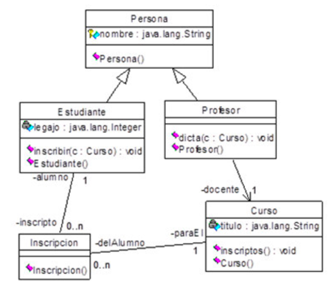

 # TP3 - RELACIONES Y USO DE PACKAGES
Implementar en dos ‘packages’ el siguiente modelo de clases y verificar su funcionamiento:

## Packages:
- Miembros (Persona, Estudiante, Profesor )
- Asignaturas (Curso, Inscripción)

## Métodos
- **inscribir**: da de alta a un estudiante en un curso
- **inscriptos**: muestra en pantalla la lista de inscriptos del curso
- **dicta**: vincula un curso con un docente

*Se deben implementar los constructores y métodos de get/set necesarios, para probar el funcionamiento.*

## Implementar estas características:
- En *Curso*, implementar la asociación con Inscripción mediante herencia de un contenedor HashTable (donde la clave es el Legajo del alumno).
- Implementar una clase excepción *ErrorInscripcion*, que sea lanzada si un alumno pretende inscribirse en más de 3 cursos.
- Parametrizar el contenedor *Curso* para que sólo acepte objetos *Inscripción*. 
- Agregar en *Profesor* un método para mostrar el nombre del curso que dicta. 
- Agregar en *Estudiante* un método para mostrar el nombre del curso en que está inscripto. 
- Agregar en *Inscripción* un método de clase, al que se le pasan como argumentos los nombres de un *Estudiante* y un *Curso*, regresando **true** si está inscripto o **false** en caso contrario. 
- Agregar en *Curso* un método que devuelva la cantidad de inscriptos en el mismo. 
- Implementar el método **main** para probar la aplicación.